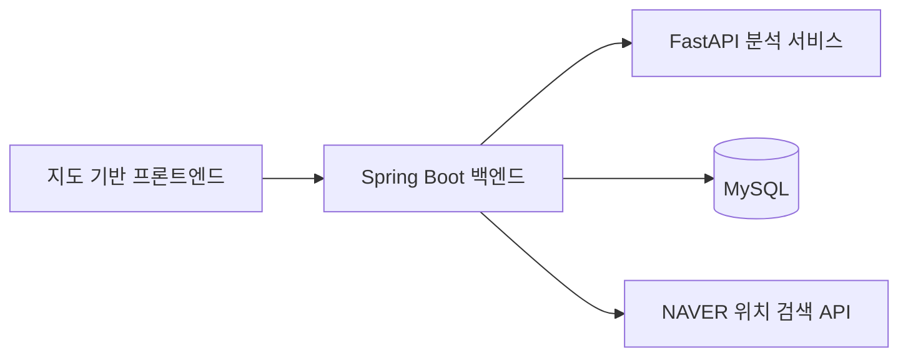

# GoldenStep Backend

보행 네트워크 기반의 **실종자 골든타임 수색 지원 서비스**, GoldenStep의 백엔드 저장소입니다.

실종자의 마지막 위치와 시각, 대상자 정보를 바탕으로 분석 서비스에 수색 예측을 요청하고, 예상 수색 영역과 우선 확인 장소를 프론트엔드에 제공합니다. 수색 세션과 분석 결과를 저장하고, 사용자가 확인한 장소를 관리합니다.

## 프로젝트 구성

GoldenStep은 세 개의 독립된 저장소로 구성됩니다.

| 구성 요소 | 역할 | 저장소 |
| --- | --- | --- |
| Backend | API 제공, 수색 세션·분석 결과 저장, 외부 서비스 연동 | 현재 저장소 |
| Frontend | 지도 기반 입력·수색 결과 화면 | [goldenstep-frontend](https://github.com/Hop-Radar/goldenstep-frontend) |
| Algorithm | 보행 네트워크 기반 수색 영역·우선 장소 분석 | [goldenstep-algorithm](https://github.com/Hop-Radar/goldenstep-algorithm) |



## 주요 기능

- **수색 정보 입력**: 마지막 위치·시각과 대상자 정보를 검증하고 수색 세션을 생성합니다.
- **비동기 분석**: 분석을 요청한 뒤 진행 상태를 조회할 수 있습니다.
- **시간대별 결과**: 현재 및 30분·1시간·3시간·6시간 이후의 예측 결과를 생성하거나 조회합니다.
- **수색 결과 제공**: 예상 수색 영역과 우선 확인 장소를 전달합니다.
- **장소 확인 관리**: 수색자가 확인한 장소의 상태를 저장합니다.
- **세션 복원**: 복원용 쿠키로 유효한 수색 세션을 다시 조회하고, 만료된 세션과 관련 데이터를 정리합니다.
- **위치 검색**: NAVER API를 이용한 장소 검색과 주소 변환을 지원합니다.

## 기술 스택

| 구분 | 기술 |
| --- | --- |
| 언어 | Java 21 |
| 프레임워크 | Spring Boot 4.1.1, Spring MVC |
| 데이터 접근 | Spring Data JPA, MySQL |
| 입력 검증 | Jakarta Bean Validation |
| 외부 연동 | Spring RestClient, FastAPI, NAVER API |
| API 문서 | springdoc OpenAPI |
| 빌드·테스트 | Gradle Wrapper, JUnit 5, Spring Boot Test |

## 디렉터리 구조

```text
src/main/java/com/tjoeun/goldenstep/
├── search/       # 수색 세션 생성·복원·만료 처리
├── analysis/     # 분석 상태, 시간대별 결과, 장소 확인
├── location/     # 장소 검색과 주소 변환
├── ai/           # 실제·모의 분석 클라이언트와 요청 변환
├── snapshot/     # 스냅샷 관련 데이터 모델
└── global/       # 공통 설정, 예외 처리, 상태 확인
src/main/resources/  # 환경별 설정, SQL, 모의 분석 데이터
src/test/java/       # 단위·통합 테스트
.github/workflows/   # GitHub Actions 워크플로
```

## 협업 안내

PR에는 변경 목적, 주요 동작 변경, 검증 결과를 작성합니다. 프론트엔드·분석 서비스에 영향을 주는 API나 설정 변경은 함께 명시합니다. 계정 식별자, 운영 서버 접속 정보, API 키 및 비밀번호는 공개 문서나 소스 코드에 포함하지 않습니다.
