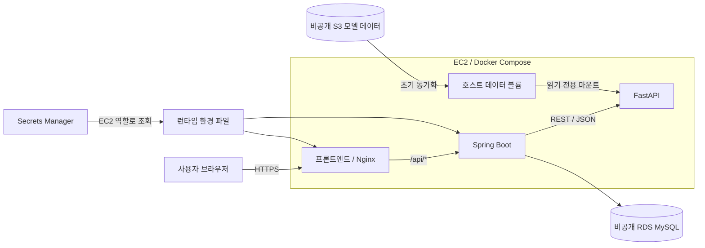

# GoldenStep 배포 아키텍처

GoldenStep은 보행 네트워크 기반 실종자 수색 지원 서비스입니다. 프론트엔드·백엔드·AI는 각각 독립된 GitHub 저장소에서 관리하며, 하나의 AWS 계정에 배포합니다. 이 디렉터리는 세 서비스의 공통 인프라와 초기 배포 도구를 관리합니다.

이 문서는 공개 저장소용 아키텍처 설명입니다. 계정 ID, 리소스 ID·ARN, 실제 IP·도메인·DB endpoint, 자격증명 및 내부 운영 기록은 포함하지 않습니다. 예시 값은 배포 환경에 맞게 설정해야 합니다.

## 서비스 구성

서울 리전(`ap-northeast-2`)의 단일 EC2에서 Docker Compose로 세 서비스를 실행합니다. RDS는 private subnet에 배치하고, 외부 요청은 Nginx로 받습니다.

| 서비스 | 기술 | 역할 | 포트 |
| --- | --- | --- | --- |
| 프론트엔드 | Nginx, HTML·CSS·JavaScript | 정적 화면, HTTPS, API 프록시 | 외부 80/443 |
| 백엔드 | Java 21, Spring Boot | 입력 검증, 세션 관리, AI 호출, 결과 저장 | 내부 8080 |
| AI | Python 3.11, FastAPI | 그래프 기반 수색 분석, POI 순위 계산 | 내부 8000 |
| DB | RDS MySQL | 세션과 분석 결과 저장 | private network 3306 |



브라우저의 지도 표시는 NAVER Maps SDK를 사용합니다. 주소 변환은 백엔드의 외부 API 연동으로 처리하며, 보행 경로 안내는 TMAP API를 사용합니다. 수색 결과는 24시간 보관하고 백엔드 스케줄러로 정리합니다.

## AWS 리소스와 접근 제어

- **네트워크**: VPC, public subnet, 두 private subnet, Internet Gateway, EC2·RDS 보안 그룹을 구성합니다.
- **EC2**: Nginx의 HTTP·HTTPS만 공개합니다. 백엔드와 AI 포트는 Docker 내부 네트워크에서 사용합니다.
- **RDS**: 공개 접근을 비활성화하고 EC2 보안 그룹에서 오는 MySQL 연결만 허용합니다. 저장소 암호화·자동 백업·삭제 보호를 설정합니다.
- **S3**: 모델 데이터를 저장하며 암호화·버전 관리·공개 접근 차단을 적용합니다.
- **ECR**: 서비스별 이미지를 저장하고 변경 불가 태그를 사용합니다.
- **SSM**: SSH 포트를 열지 않고 관리 명령·배포·DB 초기화 터널을 제공합니다.
- **Secrets Manager**: 애플리케이션 DB 및 외부 API 자격증명을 관리합니다.
- **IAM**: EC2 실행 역할과 GitHub 배포 역할을 구분합니다. EC2 실행 역할에 DB 관리자 Secret 조회 권한을 부여하지 않습니다.

인스턴스 유형·디스크 크기·백업 기간은 [service.yaml](service.yaml)의 파라미터와 설정을 확인합니다. IMDSv2를 사용하며 Docker 컨테이너의 메타데이터 접근을 고려해 hop limit을 설정합니다. swap은 메모리 부족 시 보조 수단이며 물리 RAM을 대체하지 않습니다.

## 파일 구성

| 파일 | 역할 |
| --- | --- |
| [foundation.yaml](foundation.yaml) | 네트워크·보안 그룹·ECR·S3·GitHub OIDC 공급자 |
| [service.yaml](service.yaml) | EC2·EIP·RDS·런타임 IAM 역할·Secret |
| [github-deploy-roles.yaml](github-deploy-roles.yaml) | 저장소별 GitHub OIDC 배포 역할 |
| [compose.prod.yaml](compose.prod.yaml) | 세 서비스의 통합 실행·네트워크·볼륨·로그 설정 |
| [nginx.prod.conf](nginx.prod.conf) | HTTPS와 백엔드 API 프록시 설정 |
| [.env.prod.example](.env.prod.example) | 이미지 URI·호스트 파일 경로 예시 |
| [backend.env.example](backend.env.example) | DB·CORS·백엔드 API 설정 예시 |
| [frontend.env.example](frontend.env.example) | 브라우저 지도·경로 API 설정 예시 |
| [scripts/bootstrap-database.py](scripts/bootstrap-database.py) | SSM 터널을 통한 스키마·애플리케이션 DB 사용자 초기화 |
| [scripts/prepare-service.py](scripts/prepare-service.py) | 운영 파일 생성·이미지 다운로드용 SSM 명령 준비 |
| [scripts/prepare-github-roles.py](scripts/prepare-github-roles.py) | GitHub ID 조회와 OIDC 역할 파라미터 생성 |
| [scripts/deploy-backend.sh](scripts/deploy-backend.sh) | 백엔드 수동 갱신·상태 확인·복구 |
| [../.github/workflows/deploy.yml](../.github/workflows/deploy.yml) | 백엔드 CD; 배포 명령은 워크플로에 포함 |

## 초기 배포 순서

1. AWS SSO로 로그인하고 대상 계정·리전을 확인합니다.
2. `foundation.yaml`의 Change Set을 검토·실행해 공통 리소스를 생성합니다.
3. `service.yaml`로 EC2·RDS·Secret을 생성하고 SSM·Docker·Compose 상태를 확인합니다.
4. S3에 모델 데이터를 업로드하고 EC2 데이터 디렉터리에 동기화합니다.
5. 서비스별 Linux amd64 이미지를 빌드하고 ECR에 업로드합니다.
6. 로컬 SSO 권한과 SSM 터널로 비공개 RDS의 스키마·애플리케이션 사용자를 초기화합니다.
7. 외부 API Secret, DNS, API 공급자의 허용 도메인과 TLS 인증서를 준비합니다.
8. `prepare-service.py`로 운영 환경 파일과 Compose·Nginx 설정을 준비합니다.
9. 컨테이너를 실행하고 HTTPS·상태 API·사용자 기능을 검증합니다.
10. GitHub 배포 역할과 저장소 Variables를 연결해 CD를 활성화합니다.

Change Set의 `CREATE_COMPLETE`는 변경 계획 생성 완료입니다. 리소스 생성 완료는 Change Set 실행 후 스택 상태로 확인합니다. 기존 스택 업데이트 시에는 리소스 교체 여부를 검토하며, S3 교체가 필요한 경우 데이터 복사와 참조 변경을 별도로 수행합니다.

## 모델 데이터와 초기화

모델 파일은 Git·Docker 이미지에 포함하지 않고 S3와 EC2 볼륨으로 관리합니다.

```text
data/
├── networks/seoul_walk_network.graphml
└── pois/
    ├── seoul_building_pois_3.parquet
    └── seoul_public_pois.geojson
```

초기 배포에서는 컨테이너 실행 전에 S3 데이터를 호스트로 동기화하고, Compose가 `/app/data`에 읽기 전용으로 마운트합니다. AI는 시작 시 데이터를 메모리에 적재하며 healthcheck가 준비 상태를 확인합니다. Parquet 데이터 로딩에는 `pyarrow` 의존성이 필요합니다.

데이터 변경은 애플리케이션 이미지 배포와 별도로 진행합니다. 파일 존재·권한·형식과 모델 로딩 결과를 확인해야 합니다.

## 환경 설정과 자격증명

실제 값은 로컬 프로필, Secrets Manager, EC2 런타임 환경 파일, GitHub Variables에서 관리합니다. `.env`·Secret 값·SSO 세션·인증서 개인 키·전체 명령 출력은 커밋하지 않습니다.

이미지 URI 예시:

```text
<AWS_ACCOUNT_ID>.dkr.ecr.<AWS_REGION>.amazonaws.com/goldenstep-backend:<GIT_SHA>
```

운영 파일 예시:

```text
/opt/goldenstep/
├── compose.prod.yaml
├── .env.prod
├── secrets/backend.env
├── secrets/frontend.env
├── nginx/default.conf
├── letsencrypt/
└── data/
```

Secret에서 생성한 환경 파일은 권한 `0600`으로 저장하고 화면에 출력하지 않습니다. 브라우저에서 사용하는 지도·경로 API 키는 사용자에게 전달되므로 공급자의 도메인 제한을 설정합니다.

백엔드는 운영 프로필 `infra,fastapi`를 사용합니다. SQL 자동 초기화는 비활성화하고 사전에 생성한 스키마를 JPA로 검증합니다. DB 연결의 `sslMode=REQUIRED`는 암호화 연결을 요구하며 서버 이름 검증까지 구성한 설정은 아닙니다.

## CI/CD

기존 CI는 PR과 개발 브랜치에서 검사를 수행합니다. 별도의 CD는 `main` push에서 실행하며 다음 단계를 수행합니다.

1. 테스트 및 실행 가능한 JAR 빌드
2. GitHub OIDC로 임시 AWS 자격증명 발급
3. 전체 Git SHA 태그로 Docker 이미지 빌드·ECR 업로드
4. 최신 `main` 커밋 확인 후 SSM 배포
5. 백엔드 컨테이너 교체·Nginx reload·준비 상태 확인
6. 실패 시 이전 환경 파일과 이미지로 복구 시도

계정 ID는 STS로 조회합니다. OIDC 역할의 신뢰 정책은 정확한 저장소 식별자와 `main`을 제한하며, ECR 권한은 해당 서비스 저장소에 한정합니다. 공통 EC2 배포 잠금은 여러 저장소의 동시 갱신을 직렬화합니다.

GitHub **Settings → Secrets and variables → Actions → Variables**에 다음 값을 등록합니다.

| 변수 | 예시 / 설정 방법 |
| --- | --- |
| `AWS_REGION` | `ap-northeast-2` |
| `AWS_ROLE_ARN` | `<GITHUB_DEPLOY_ROLE_ARN>`; 해당 저장소용 OIDC 역할 |
| `EC2_INSTANCE_ID` | `<APP_INSTANCE_ID>` |
| `SERVICE_URL` | `https://app.example.com`; 실제 배포 도메인으로 설정 |

`develop` → `main` PR 병합은 `main` push를 발생시킵니다. PR을 통한 변경만 허용하려면 별도 GitHub 브랜치 규칙을 설정합니다. CD는 CloudFormation 인프라·DB 스키마·모델 데이터를 자동으로 갱신하지 않습니다.

## 검증과 운영

- HTTPS 페이지의 HTTP 200과 `/api/health`의 `ready: true`를 확인합니다.
- 지도·주소 검색·수색 분석·결과 표시·경로 안내를 실제 브라우저에서 점검합니다.
- 분석 요청 중 CPU·메모리·swap·디스크와 컨테이너 로그를 확인합니다. 상태 API 정상만으로 DB·외부 API·동시 처리 성능이 모두 검증되지는 않습니다.
- TLS 인증서 갱신, DB 백업·복구, 장애 시 이미지 복구 및 리소스 정리 절차를 운영 환경에서 관리합니다.
- 단일 EC2·컨테이너 교체 방식은 무중단 배포나 고가용성을 보장하지 않습니다. 향후 확장 시 ECS Fargate 등의 구성을 검토합니다.
- `Retain` 정책과 RDS 삭제 보호를 확인합니다. 스택 삭제나 EC2 중지만으로 모든 리소스·요금이 정리되지는 않습니다.
